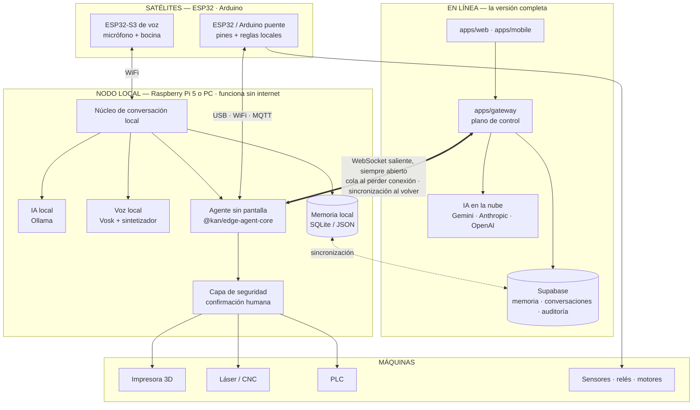

# KAN_ARCH — arquitectura unificada de KAN + Jarvis

> Escrito el 2026-10-09, al unir en un solo árbol los dos proyectos que vivían en este repositorio: **KAN** (venía comprimido en `KAN-main.zip`) y el **prototipo de Jarvis** (venía en `jarvis prototipo/`).
>
> Este documento dice qué había, cómo quedó unido, hacia dónde va y qué falta. El trabajo futuro está desglosado en [`docs/tickets/`](docs/tickets/README.md). El detalle fino de la plataforma sigue en [`docs/`](docs/README.md) y no se repite aquí.

## 1. Lo que había (auditoría)

### KAN — la plataforma

Monorepo TypeScript (Turborepo + pnpm): 981 archivos, unas 66 000 líneas de TypeScript, 138 archivos de prueba, 58 decisiones de arquitectura documentadas (ADR) y 22 migraciones de base de datos.

| Pieza | Dónde | Estado |
|---|---|---|
| Chat web, voz, panel | `apps/web` (Next.js) | Construido; despliegue pensado para Vercel |
| Plano de control | `apps/gateway` + `packages/gateway-core` | Construido; **exige Supabase para arrancar** |
| Agente local con interfaz | `apps/desktop` (Electron) + `packages/edge-agent-core` | Construido; **solo existe con ventana**, no como servicio |
| App móvil | `apps/mobile` (Expo) | Construida |
| Núcleo de conversación | `packages/core` | Construido: llamadas a herramientas, memoria, personalidad |
| Proveedores de IA | `packages/ai-abstraction` | Gemini, Anthropic y OpenAI. **Ninguno local** |
| Voz | `packages/voice-abstraction` | Groq, OpenAI y Gemini. **Toda en la nube** |
| 18 plugins de dispositivo | `plugins/` | Construidos y probados contra simuladores. **La validación con hardware real está pendiente** en G-code y ESP32 (lo dicen sus propios README) |

El estado de esta tabla sale de leer el código y su documentación. En la unificación no se pudo ejecutar la batería de pruebas (ver §7).

Los plugins cubren ya casi todas las máquinas del plan:

| Máquina | Plugin | Qué hace hoy | Qué falta |
|---|---|---|---|
| Impresora 3D | `plugin-gcode` | Mover ejes, temperaturas, imprimir un G-code por streaming, pausar, cancelar | Laminar un STL, OctoPrint/Klipper, vigilancia por cámara |
| Láser y CNC | `plugin-gcode` | Encender/apagar láser o husillo, mover, G-code suelto, paro de emergencia | Trabajos completos de corte, convertir un dibujo a G-code, enclavamientos de seguridad |
| ESP32 y Arduino | `plugin-esp32-arduino` | Leer y escribir pines, compilar y subir un sketch con `arduino-cli`, respaldo de firmware | Flujo «KAN, programa esto», reglas locales, autenticación del firmware WiFi, OTA |
| MicroPython | `plugin-micropython` | Leer, escribir, respaldar y restaurar archivos de la placa | Ejecutar código y reiniciar la placa |
| Raspberry Pi | `plugin-raspberry-pi`, `plugin-ssh` | Pines digitales, comandos y archivos por SSH | PWM, I2C, ADC, despliegue de servicios |
| PLC | `plugin-modbus`, `plugin-opcua` | Leer y escribir registros y nodos | **Programar** el PLC (hoy solo intercambia datos) |
| Otros | MQTT, Home Assistant, Bluetooth, CAN, serial, HTTP, WebSocket, red, visión | Clientes genéricos | — |

### Jarvis — el prototipo local

Cinco scripts de Python (unas 330 líneas) que hacen lo que KAN no hace: **funcionar sin internet**.

| Capacidad | Cómo | Estado |
|---|---|---|
| IA local | Ollama con `qwen2.5:3b` | Escrito para la PC del autor |
| Oír sin internet | Vosk, modelo español 0.42 | Ruta del modelo fija a una carpeta de Windows |
| Hablar sin internet | pyttsx3 | Solo en `jarvis_voz.py` |
| Memoria | Archivo JSON | La voz no la usa |
| Control de dispositivos | — | No tiene |

### Cómo se relacionan

No compiten: **se complementan casi sin traslaparse**. KAN es una plataforma completa que depende de la nube; Jarvis es un cerebro local sin manos. Lo único duplicado es memoria y personalidad.

| Tema | KAN | Jarvis | Destino |
|---|---|---|---|
| Modelo de IA | Nube (Gemini, Anthropic, OpenAI) | Local (Ollama) | Ollama entra como un proveedor más del mismo enrutador → KAN-110, KAN-111 |
| Voz | Nube | Local (Vosk, pyttsx3) | Vosk y un sintetizador local entran detrás del mismo puerto de voz → KAN-113 |
| Memoria | Tabla `memories` en Supabase | `memoria_jarvis.json` | Una sola memoria con copia local y sincronización → KAN-132 |
| Personalidad | Configurable por usuario | Texto fijo «Eres JARVIS…» | Una sola identidad; **decisión pendiente** → KAN-102 |
| Dispositivos | 18 plugins | Ninguno | Se quedan los de KAN |

## 2. Cómo quedó unido

Se conservó la estructura del monorepo de KAN como base y el prototipo entró como una aplicación más.

```
proyecto-ironman/
├── apps/
│   ├── web/            Chat, voz y panel (Next.js)
│   ├── gateway/        Plano de control (Node, WebSocket)
│   ├── desktop/        Agente local con interfaz (Electron)
│   ├── mobile/         App móvil (Expo)
│   └── jarvis-local/   ← el prototipo de Jarvis, sin cambios de código
├── packages/           Núcleo, IA, voz, agente, contrato y SDK de plugins
├── plugins/            18 controladores de dispositivo (2 con firmware Arduino)
├── supabase/           Migraciones de la base de datos
├── docs/               Arquitectura, ADR, hoja de ruta
│   ├── prompts/        Los dos «prompts maestros» originales, intactos
│   └── tickets/        ← trabajo futuro, un archivo por ticket
├── KAN_ARCH.md         Este documento
└── README.md           Entrada al proyecto unificado
```

### Por qué no `core/`, `hardware_bridges/` y `digital_services/`

El prompt de orquestación que estaba en el README pedía clasificar el código en esas tres carpetas, con un backend central en Python. No se hizo así, y es una decisión deliberada: KAN ya tiene esa misma separación resuelta con otros nombres, 138 archivos de prueba y la configuración de build, CI y despliegue atada a sus rutas. Renombrar carpetas habría roto todo eso sin ganar nada. La equivalencia es directa:

| Categoría pedida | Dónde vive en este repo |
|---|---|
| `core/` — lenguaje, decisiones, enrutado de comandos | `packages/core`, `packages/ai-abstraction`, `packages/gateway-core`, `apps/gateway` |
| `hardware_bridges/` — firmware, serial, MQTT, drivers | `packages/edge-agent-core`, `packages/serial-line-transport`, `plugins/plugin-*` de dispositivo, `plugins/plugin-esp32-arduino/firmware/` |
| `digital_services/` — automatización de software, APIs, visión, paneles | `apps/web`, `apps/mobile`, `plugins/plugin-http-generic`, `plugin-ws-generic`, `plugin-ssh`, `plugin-network-tools`, `plugin-vision-py`, `plugin-home-assistant` |

El núcleo central queda en TypeScript, no en Python. Python sigue teniendo su lugar donde ya lo tenía: procesos auxiliares para visión, Bluetooth y, a partir de ahora, voz local.

### Qué se movió y qué no se tocó

| Antes | Después | Nota |
|---|---|---|
| `KAN-main.zip` | Contenido en la raíz | Los 981 archivos, byte por byte. El zip se quitó del árbol; sigue en el historial de `main` |
| `jarvis prototipo/` | `apps/jarvis-local/` | Movido sin editar, respaldo incluido. Se añadieron un README y un `requirements.txt` |
| `README.md` (prompt de orquestación) | `docs/prompts/prompt-maestro-orquestacion.md` | Intacto |
| `README.md` de KAN (prompt maestro + despliegue) | `docs/prompts/prompt-maestro-kan.md` | Intacto. La sección de despliegue se copió también al README nuevo |

No se modificó ningún archivo de código de ninguno de los dos proyectos. Los únicos archivos preexistentes editados son dos de documentación: `docs/README.md` (índice) y `docs/10-backlog-y-tareas.md` (épicas nuevas).

## 3. A dónde va: un asistente, tres formas de estar presente



### Las tres formas

**1. En línea.** Lo que KAN ya es: chat, voz y panel desde cualquier navegador o teléfono, con los mejores modelos disponibles.

**2. Nodo local.** Una Raspberry Pi 5 o una PC dentro del taller que corre todo lo necesario para trabajar sin internet: modelo de IA, voz, memoria, agente y capa de seguridad. Es en lo que se convierte el prototipo de Jarvis. Con internet, mantiene una conexión saliente permanente con la versión en línea; sin internet, sigue funcionando por su cuenta y encola lo que haya que subir.

**3. Satélites.** Placas pequeñas repartidas por el taller. Son los oídos, la voz y las manos del nodo, no un segundo cerebro.

### Lo que una placa puede y no puede hacer

Esto conviene dejarlo claro desde ahora, porque condiciona el diseño:

| Placa | ¿Corre el modelo de IA? | Papel realista |
|---|---|---|
| Raspberry Pi 5 (8 GB o más) | Sí, modelos pequeños (1 a 3 mil millones de parámetros). Respuestas en segundos, no al instante | **Nodo local completo** |
| Raspberry Pi 4 / Zero | Apenas o no | Agente de dispositivos; el modelo corre en otra máquina de la red |
| ESP32 (S3 recomendado) | **No.** Tiene unos pocos MB de memoria; un modelo de lenguaje necesita miles | Satélite: micrófono, bocina, sensores, relés. Sin conexión puede reconocer un puñado de frases fijas y ejecutar reglas guardadas |
| Arduino UNO / Nano | **No.** 2 KB de memoria | Puente de pines por USB y, como mucho, un estado seguro si pierde la conexión |

Es decir: la «copia local» que funciona sin internet vive en la Raspberry Pi o en una PC. En un ESP32 o un Arduino no cabe una copia del asistente, pero sí una parte útil de él: obedecer reglas que el asistente le dejó guardadas y seguir actuando aunque se caiga todo lo demás.

Los modelos locales pequeños se equivocan más que los de la nube al elegir herramientas. Por eso, en modo sin conexión las acciones físicas quedan más restringidas, no menos (KAN-180).

### Siempre conectado con la versión en línea

Buena parte ya existe en KAN y se reutiliza:

| Necesidad | Ya existe | Falta |
|---|---|---|
| Canal permanente nodo ↔ nube | WebSocket saliente del agente al Gateway, con reconexión | Probarlo con el nodo en una Raspberry Pi → KAN-136 |
| Vincular el nodo a tu cuenta | Emparejamiento del agente (ADR-033) | Flujo sin pantalla → KAN-131 |
| No perder nada si se cae internet | Cola en memoria de 200 mensajes | Que sobreviva a un reinicio → KAN-133 |
| Misma memoria en ambos lados | Memoria en Supabase | Copia local y sincronización → KAN-130, KAN-132 |
| Mismo historial | Conversaciones en Supabase | Sincronizar las hechas sin conexión → KAN-134 |
| Saber en qué modo está | — | Detección y aviso → KAN-135 |
| Gateway sin nube | — | Hoy no arranca sin Supabase → KAN-121 |

## 4. El camino del prototipo

El prototipo no se reescribe de golpe ni se tira. Se absorbe por partes, y sus scripts siguen funcionando hasta que el nodo local los reemplace:

1. **Ordenarlo** sin cambiar lo que hace: configuración por variables de entorno, un solo punto de entrada (KAN-101).
2. **Su cerebro pasa a KAN**: Ollama como proveedor de IA (KAN-110) y el enrutador eligiendo entre nube y local (KAN-111).
3. **Su voz pasa a KAN**: Vosk y un sintetizador local detrás del puerto de voz (KAN-113).
4. **Su memoria se une a la de KAN** (KAN-132).
5. **Nace el nodo local**: agente sin pantalla (KAN-120), Gateway sin nube (KAN-121), conversación local (KAN-122).
6. **Se retiran los scripts sueltos** cuando el nodo cubre todo lo que hacían (KAN-125).

## 5. Seguridad física

KAN ya trae la regla que más importa y la unificación no la cambia: **el modelo propone, nunca autoriza**. Toda acción lleva una severidad (`read-only`, `reversible`, `irreversible-material`, `safety-critical`) y las peligrosas esperan la confirmación explícita de una persona (ADR-004): en la app de escritorio o, desde ADR-059, con botones en el chat web y por voz. Parar siempre es inmediato y sin confirmación.

Lo que la visión nueva obliga a añadir:

- Un nodo sin pantalla y sin internet se queda sin ninguna de esas formas de confirmar; necesita una propia: botón físico, teléfono en la red local o voz local (KAN-120).
- Los modelos locales pequeños necesitan una lista corta de herramientas permitidas (KAN-180).
- Un láser no debe poder encenderse sin enclavamientos físicos, diga lo que diga el software (KAN-162).
- Un satélite que pierde conexión debe ir a un estado seguro (KAN-142).
- El firmware WiFi del ESP32 acepta hoy órdenes de cualquiera en la red (KAN-146).

## 6. Decisiones que te tocan a ti

No se tomaron en la unificación porque son de producto o afectan a cuentas tuyas:

1. **Nombre e identidad**: ¿el asistente se llama KAN, JARVIS, o KAN con una personalidad «Jarvis»? Afecta a la palabra de activación y a los textos (KAN-102).
2. **Memoria en repositorio público**: `apps/jarvis-local/memoria_jarvis.json` está a la vista de cualquiera (KAN-103).
3. **Despliegue automático**: al quedar `.github/workflows/` en la raíz, GitHub empezará a ejecutar las pruebas en cada cambio, y `deploy.yml` intentará publicar en Vercel con cada cambio a `main`. Sin los secretos configurados, ese paso fallará en rojo (KAN-104).
4. **Hardware del nodo local**: Raspberry Pi 5 o una PC. Decide qué modelo de IA cabe (KAN-112).
5. **Carpeta de respaldo** del prototipo: es una copia idéntica; se puede borrar (KAN-101).

## 7. Qué se verificó y qué no

| Comprobación | Resultado |
|---|---|
| Los 981 archivos del zip están en el árbol, idénticos byte por byte | Verificado |
| Los scripts del prototipo no cambiaron respecto a `main` | Verificado |
| Los scripts del prototipo compilan | Verificado (`py_compile`) |
| El prototipo en `apps/` no interfiere con pnpm ni Turborepo | Verificado: no tiene `package.json`, queda fuera del espacio de trabajo |
| No hay claves ni secretos en lo que se añadió | Verificado con una búsqueda de patrones de claves; solo hay archivos `.env.example` |
| Lint, tipos y pruebas de KAN | **No ejecutado**: el entorno donde se hizo la unificación no tenía acceso al registro de npm. Lo correrá la CI de GitHub al subir la rama |
| Prototipo funcionando con Ollama, Vosk y micrófono | **No ejecutado**: requiere tu máquina |

